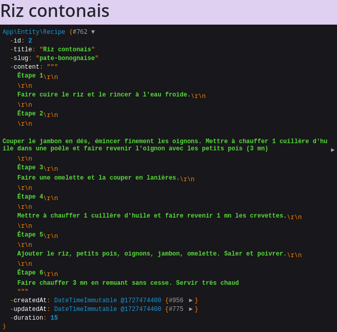
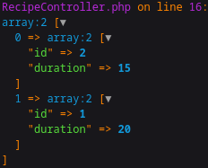
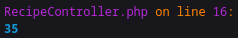

# L'ORM Doctrine

## Environnement


Configurer la connexion à la base de données PostgreSQL via le fichier *TutoSymfony/.env* en indiquant la version (`psql -V`).

```bash
DATABASE_URL="postgresql://$POSTGRES_USER:$POSTGRES_PASSWORD@$POSTGRES_URL:5432/$POSTGRES_DB?serverVersion=15.8&charset=utf8"
```

L'url de connexion est construite via les variables d'environnements consignées dans le fichier *.bashrc*

```bash
# PGPASSWORD=postgres psql -h localhost -U postgres -d mydb
export POSTGRES_USER="postgres"
export POSTGRES_PASSWORD="postgres"
export POSTGRES_DB="mydb"
export POSTGRES_URL="localhost"
```

<br>

## Model

Création du *model* &nbsp;&#8640;&nbsp; `php bin/console make:entity Recipe`

###  Création des champs

Le *model* et le *reposirory*  de *Recipe* définis sous :

- **TutoSymfony/src/Entity/Recipe.php**
- **TutoSymfony/src/Repository/RecipeRepository.php**


#### **title**

```bash
 New property name (press <return> to stop adding fields):
 > title

 Field type (enter ? to see all types) [string]:
 > 

 Field length [255]:
 > 100 

 Can this field be null in the database (nullable) (yes/no) [no]:
 > 
```

#### **slug**

```bash
 New property name (press <return> to stop adding fields):
 > slug

 Field type (enter ? to see all types) [string]:
 > 

 Field length [255]:
 > 100

 Can this field be null in the database (nullable) (yes/no) [no]:
 >
```

#### **content**

```bash
 New property name (press <return> to stop adding fields):
 > content

 Field type (enter ? to see all types) [string]:
 > text

 Can this field be null in the database (nullable) (yes/no) [no]:
 >
```

#### **createdAt**

```bash
 New property name (press <return> to stop adding fields):
 > createdAt

 Field type (enter ? to see all types) [datetime_immutable]:
 > 

 Can this field be null in the database (nullable) (yes/no) [no]:
 >
```

#### **updatedAt**

```bash
 New property name (press <return> to stop adding fields):
 > updatedAt

 Field type (enter ? to see all types) [datetime_immutable]:
 > 

 Can this field be null in the database (nullable) (yes/no) [no]:
 > 
```
#### **duration**

```bash
 New property name (press <return> to stop adding fields):
 > duration

 Field type (enter ? to see all types) [string]:
 > integer

 Can this field be null in the database (nullable) (yes/no) [no]:
 > yes
```

<br>

## Création des tables

#### Script de création

- Fichiers de création des tables &nbsp;&#8640;&nbsp; `php bin/console make:migration`

Le script *TutoSymfony/migrations/**VersionYYYYMMDDXXXXXX.php*** doit être vérifié avant sont exécution.

#### Création sous *Postgres*

- Création des tables sous *ProsgreSQL* &nbsp;&#8640;&nbsp; `php bin/console doctrine:migration:migrate --no-interaction`


La table a été créée avec les types de champ suivants :


## Données de test

```sql
TRUNCATE TABLE Recipe;

INSERT INTO "recipe" ("id", "title", "slug", "content", "created_at", "updated_at", "duration")
VALUES 
(1, 'Pâte bonognaise', 'pate-bonognaise', 'Étape 1
Épluchez et émincez finement les oignons et l''ail.

Étape 2
Faites chauffer l''huile d''olive dans une poêle sur feu vif. Quand l’huile d’olive est bien chaude, déposez les oignons et l’ail émincés dans la poêle et faites-les revenir pendant 3 min, en remuant bien, jusqu''à ce que les oignons soient bien translucides. Ajoutez ensuite la viande de bœuf hachée, puis poursuivez la cuisson pendant 3 à 4 min sans cesser de mélanger, jusqu''à ce qu''elle ne soit plus rosée.

Étape 3
Incorporez les tomates pelées, les branches de thym et la feuille de laurier. Salez et poivrez selon vos goûts, ajoutez le sucre, puis mélangez. Baissez sur feu doux et laissez mijoter pendant 10 min environ, en remuant régulièrement.

Étape 4
Pendant ce temps, portez à ébullition un grand volume d’eau salée dans une casserole sur feu vif. Dès l’ébullition, plongez les spaghettis dans l’eau bouillante et laissez-les cuire en suivant les instructions du paquet ou jusqu’à ce qu’ils soient al dente. Lorsque les spaghettis sont cuits, égouttez-les dans une passoire et réservez-les au chaud.', '2024-09-28', '2024-09-28', '20'),
(2, 'Riz contonais', 'pate-bonognaise', 'Étape 1

Faire cuire le riz et le rincer à l''eau froide.

Étape 2

Couper le jambon en dés, émincer finement les oignons. Mettre à chauffer 1 cuillère d''huile dans une poêle et faire revenir l''oignon avec les petits pois (3 mn). Verser le mélange dans un plat.

Étape 3
Faire une omelette et la couper en lanières.

Étape 4

Mettre à chauffer 1 cuillère d''huile et faire revenir 1 mn les crevettes.

Étape 5

Ajouter le riz, petits pois, oignons, jambon, omelette. Saler et poivrer.

Étape 6
Faire chauffer 3 mn en remuant sans cesse. Servir très chaud', '2024-09-28', '2024-09-28', '15');
```

## Récupération des données

### Récupération de toutes les données

Mondifions le fichiers *RecipeController.php*

```php
class RecipeController extends AbstractController
{
    #[Route('/recipe', name: 'recipe.index')]
    public function index(RecipeRepository $recipeRepository): Response {

      // Récupération des toutes les données de la table 
      $recipes = $recipeRepository->findAll();
      // Affichage des traces
      dd($recipes);
      ...
    }
    ...
}
```

Les traces du *controller* affiche le résultat suivant :


<br>

Que l'on peut directement afficher dans la page web en modifiant :

- Le *controller*

```php
class RecipeController extends AbstractController {
    #[Route('/recipe', name: 'recipe.index')]
    public function index(RecipeRepository $recipeRepository): Response {
        $recipes = $recipeRepository->findAll();
        return $this->render('recipe/index.html.twig', [
            'recipes' => $recipes,
        ]);
    }
    ...
}
```

- la page web *TutoSymfony/templates/recipe/index.html.twig*

```html
<h1>Recipes</h1>
<ul>
	
		<li>
			<a href="{{ url('recipe.show', { id: recipe.getId(), slug: recipe.getSlug() }) }}">{{ recipe.getTitle() }}</a>
		</li>
	
</ul>
```

<br>

Le notation peut-être simplifiée :

```html
<h1>Recipes</h1>
<ul>
	
	<li>
		<a href="{{ url('recipe.show', { id: recipe.id, slug: recipe.slug }) }}">{{ recipe.title }}</a>
	</li>
	
</ul>
```

<br>

Les liens sont encore codé "en dur" ...

```php
#[Route('/recipe/{slug}/{id}', name: 'recipe.show')]
public function show(string $slug, int $id): Response {
   return $this->render('recipe/show.html.twig', [
      'slug' => $slug,
         'id' => $id,
         'person' => [
             'firstname' => 'John',
             'lastname' => 'DOE'
         ]
      ]);
}
```

### Récupération des données par *primary key*


La sélection d'un recette est obtenue par la page web **TutoSymfony/templates/recipe/index.html.twig** listant l'ensemble des recettes :

```html
<h1>Recipes</h1>
<ul>
	
	<li>
      <!-- Le 'slug' est innutilisé (supprimé) -->
		<a href="{{ url('recipe.show', { id: recipe.id }) }}">{{ recipe.title }}</a>
	</li>
	
</ul>
```

<br>

La sélection des *Recipes* obtenue via des liens.


<br>

L'identifiant renvoyé par la page permet de sélectionner une recette afin d'en afficher le détail.

```php
#[Route('/recipe/{id}', name: 'recipe.show')]
public function show(RecipeRepository $recipeRepository, int $id): Response {
   return $this->render('recipe/show.html.twig', [
      // Récupération par la 'Primary key'
      'recipe' => $recipeRepository->find($id)
      ]);
}
```

Le contenu de la recette est affiché dans la page *TutoSymfony/templates/recipe/show.html.twig*.

```html
<div class="example-wrapper">
	<h1>{{ recipe.title }}</h1>
   {{ dump(recipe) }}
</div>
```

A travers un *dump*.




<br>

### Récupération des données par le *slug*

La sélection d'un recette est obtenue par la page web **TutoSymfony/templates/recipe/index.html.twig** listant l'ensemble des recettes :

```html
<h1>Recipes</h1>
<ul>
	
	<li>
		<a href="{{ url('recipe.show', { slug: recipe.slug }) }}">{{ recipe.title }}</a>
	</li>
	
</ul>
```

<br>

L'identifiant renvoyé par la page permet de sélectionner une recette afin d'en afficher le détail.

```php
#[Route('/recipe/{slug}', name: 'recipe.show')]
public function show(RecipeRepository $recipeRepository, string $slug): Response {
   return $this->render('recipe/show.html.twig', [
         // Récupération par le 'slug'
         'recipe' => $recipeRepository->findOneBy(['slug' => $slug])
      ]);
   }
```

### Récupération des recettes d'une durée inférieur à 10 minutes

Mettre à jour le fichier *TutoSymfony/src/Repository/RecipeRepository.php* en ajoutant la méthode exécutant la requête.

```php
/**
 * @param int $duration
 * @return Recipe[]
 */
public function findWithDurationLowerThan(int $duration): array {
  return $this->createQueryBuilder('r')
      ->where('r.duration <= :duration')
      ->setParameter('duration', $duration)
      ->setMaxResults(30)
      ->orderBy('r.duration', 'ASC')
      ->getQuery()
      ->getResult();
}
```

Appeler la requête dans le *controller*.


```php
#[Route('/recipe', name: 'recipe.index')]
public function index(RecipeRepository $recipeRepository): Response {
   
   // Liste des recettes
   $recipes = $recipeRepository->findWithDurationLowerThan(30);

   return $this->render('recipe/index.html.twig', [
      'recipes' => $recipes,
     ]);
}
```

<br>

### Sélection de champs individuels

```php
/**
 * @return Recipe[]
 */
public function findSelect(): array {
  return $this->createQueryBuilder('r')
      ->select('r.id', 'r.duration')
      ->orderBy('r.duration', 'ASC')
      ->getQuery()
      ->getResult();
}
```
<br>



<br>


### Somme des durées de préparation des recettes

Mettre à jour le fichier *TutoSymfony/src/Repository/RecipeRepository.php* en ajoutant la méthode exécutant la requête.

```php
/**
 * @return int
 */
public function findTotalDuration() {
   return $this->createQueryBuilder('r')
      ->select('sum(r.duration) as total')
      ->getQuery()
      ->getOneOrNullResult();
}
```

<br>

Résultat :

