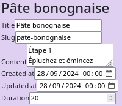
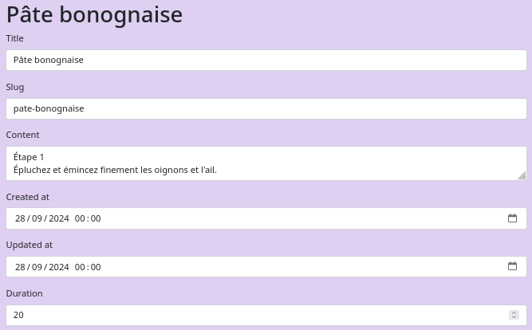
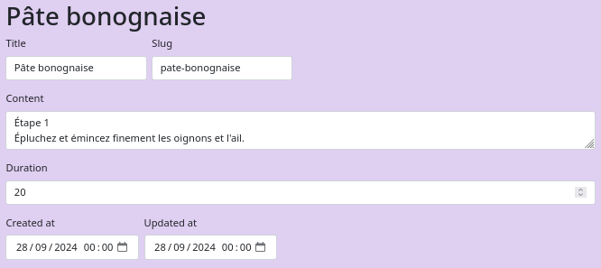
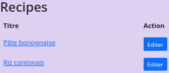
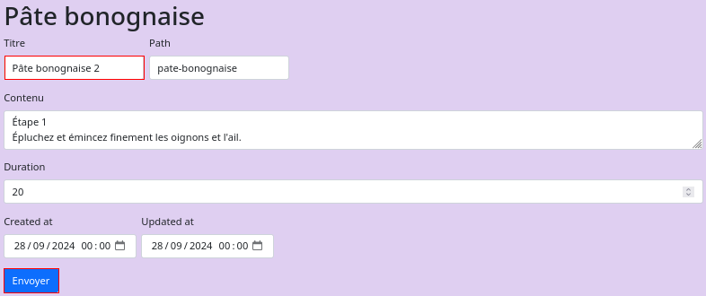
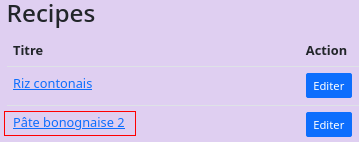
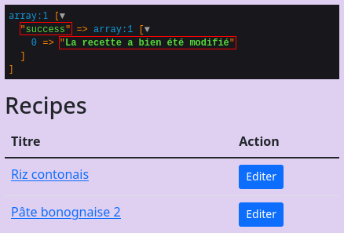
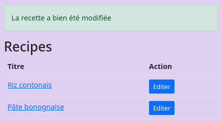
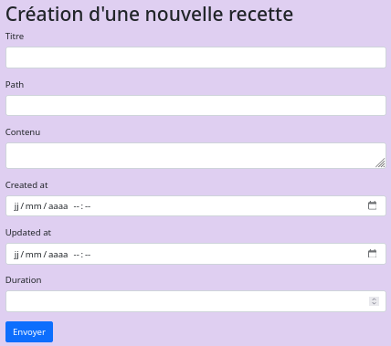

# Les formulaires


Commençons par créer le formulaire contruit selon l'objet *Recipe*.<br>
:warning: Les données associées au formulaire seront gérées dans le *controller*.

Création du formulaire &nbsp;&#8640;&nbsp; `php bin/console make:form RecipeType`

```bash
 The name of Entity or fully qualified model class name that the new form will be bound to (empty for none):
 > Recipe
```

<br>

Le formulaire généré est la suivant :

```php
class RecipeType extends AbstractType {

    public function buildForm(FormBuilderInterface $builder, array $options): void {
        $builder
            ->add('title')
            ->add('slug')
            ->add('content')
            ->add('createdAt', null, ['widget' => 'single_text', ])
            ->add('updatedAt', null, ['widget' => 'single_text', ])
            ->add('duration');
    }

    public function configureOptions(OptionsResolver $resolver): void {
        $resolver->setDefaults([
            // Formulaire va traiter un objet de type 'Recipe'
            'data_class' => Recipe::class,
        ]);
    }
}
```

## Affichage du formulaire

L'intégration du formulaire dans la nouvelle page web *TutoSymfony/templates/recipe/**edit.html.twig*** est obtenu via le *controller*.
:warning: Pour le moment, il ne permet pas d'effectuer de mise à jour.

```php
#[Route('/recipe/edit/{id}', name: 'recipe.edit')]
// Récupération par la 'Primary key' dans l'instance '$recipe'
public function edit(Recipe $recipe): Response {

// Création de l'instance du formulaire initialisée 
// avec l'injection des données dans l'instance '$recipe'.
$form = $this->createForm(RecipeType::class, $recipe);

return $this->render('recipe/edit.html.twig', [
   'recipeData' => $recipe, // Données récupérées de la base
   'recipeForm' => $form // Formulaire
  ]);
}
```

<br>

Le formulaire est affiché sur la web *TutoSymfony/templates/recipe/**edit.html.twig*** via la balise *form*.<br>


```html
<h1>{{ recipeData.title }}</h1> <!-- Données récupérées de la base -->
{{ form(recipeForm)}} <!-- Formulaire -->
```
<br>

On obtient le rendu disgracieux suivant :



<br>

Cela peut-être corrigé par la mise à jour du fichier *TutoSymfony/config/packages/**twig.yaml***

```yaml
twig:
    file_name_pattern: '*.twig'
    form_themes: ['bootstrap_5_layout.html.twig']
```

<br>

Le rendu est à présent le suivant :



<br>

La mise en page peut encore être améliorée en distinguant l'ensemble des champs.

```html
<h1>{{ recipeData.title }}</h1>
{{ form_start(recipeForm) }}
<div class="d-flex gap-2">
	{{ form_row(recipeForm.title) }}
	{{ form_row(recipeForm.slug) }}
</div>
<div class="d-flex flex-column">
	{{ form_row(recipeForm.content) }}
   {{ form_row(recipeForm.duration) }}
</div>
<div class="d-flex gap-2">
	{{ form_row(recipeForm.createdAt) }}
	{{ form_row(recipeForm.updatedAt) }}
</div>
{{ form_end(recipeForm) }}
```

<br>

Ce permet le rendu suivant :



<br>

L'édition d'une recette peut être facilité en modifiant la page web *TutoSymfony/templates/recipe/**index.html.twig***.

```html	<h1>Recipes</h1>
<table class="table">
	<tbody>
		<tr>
			<th>Titre</th>
			<th>Action</th>
		</tr>
	</tbody>
	
		<tr>
			<td><a href="{{ url('recipe.show', { id: recipe.id }) }}">{{ recipe.title }}</a></td>
			<td><a class="btn btn-primary btn-sm" href="{{ path("recipe.edit", {id: recipe.id }) }}">Editer</a></td>
		</tr>
	
</table>
```

<br>

Il suffira de cliquer sur le bouton *Editer*



<br>

## Mise à jour d'une recette

Mettre à jour le formulaire en y ajoutant un bouton ***Submit*** et le typage des données

```php
class RecipeType extends AbstractType {
   public function buildForm(FormBuilderInterface $builder, array $options): void {
     $builder
         ->add('title', TextType::class, ['label' => 'Titre'])
         ->add('slug', TextType::class, ['label' => 'Path'])
         ->add('content', TextareaType::class, ['label' => 'Contenu'])
         ->add('createdAt', DateTimeType::class )
         ->add('updatedAt', DateTimeType::class )
         ->add('duration', IntegerType::class)
         ->add('save', SubmitType::class, ['label' => 'Envoyer']);
   }
   ...
}
```
<br>

Le bouton a été ajouté et le titre modifié afin de tester la mise à jour




<br>

Modifier le *controller* pour prendre en charge la mise à jour d'un enregistre.

```php
#[Route('/recipe/edit/{id}', name: 'recipe.edit')]
public function edit(Recipe $recipe, 
                     Request $request, 
                     EntityManagerInterface $em): Response  {

   // Création de l'instance du formulaire initialisée 
   // avec l'injection des données dans l'instance '$recipe'.
   $form = $this->createForm(RecipeType::class, $recipe);

   // Récupère les données mise à jour de la page web.
   // pour mettre à jour celle de l'instance '$recipe'
   // L'absence de données dans la $request au premier appel
   // n'écrase pas celles présentes dans l'instance '$recipe'.
   $form->handleRequest($request);

   // Information obtenues par le 'handleRequest'
   // précédement appelé.
   if($form->isSubmitted() && $form->isValid()) {
      // Mise à jour de la base de données.
      $em->flush();
      // Redirection vers la liste des recettes.
      return $this->redirectToRoute('recipe.index');
   }

   // Page permettant la mise à jour d'une recette
   return $this->render('recipe/edit.html.twig', [
      'recipeData' => $recipe,
      'recipeForm' => $form
     ]);
}
```

<br>

La mise à jour a correctement été effectuée.



<br>

## Message *flash*

On souhaitre retourner l'information de le transaction de mise à jour dans une boîte de message.


```php
#[Route('/recipe/edit/{id}', name: 'recipe.edit')]
public function edit(Recipe $recipe, 
                     Request $request, 
                     EntityManagerInterface $em): Response  {
   ...
   if($form->isSubmitted() && $form->isValid()) {
      $em->flush();
      // Envoie du message dans variable globale 'app'
      $this->addFlash('success', 'La recette a bien été modifié');
      return $this->redirectToRoute('recipe.index');
   }
   ...
}
```

<br>


Le message est récupéré dans l'objet *app.flashes* dans le fichier html commun *TutoSymfony/templates/**base.html.twig*** suite à la mise à jour du titre.

```html
<div class="container my-4">
   <!-- Récupération du message 'Flash' -->
	{{ dump(app.flashes) }}
	<!-- Fichiers incluant des 'base.html.twig' -->
	
</div>
```

<br>

Le message apparait à travers deux tableaux imbriqués.



<br>

L'affichage des messages messages seront traités dans le fichier *TutoSymfony/templates/partials/**flash.html.twig*** de la façon suivante :

```html

<div class="alert alert-{{ type }}">
	{{ messages | join('. ') }}
</div>

```

<br>

Ce fichier sera inclus dans le fichier commun *TutoSymfony/templates/partials/**flash.html.twig***.

```html
<div class="container my-4">
   <!-- Récupération du message 'Flash' -->
	
	<!-- Fichiers incluant des 'base.html.twig' -->
	
</div>
```

<br>

Ce qui permet d'obtenir le rendu suivant :




<br>

## Création d'une nouvelle recette


Modifier le *controller* pour prendre en charge l'ajout d'un nouvel enregistrement'.

```php
#[Route('/recipe/create', name: 'recipe.create')]
// Récupération par la 'Primary key' dans l'instance '$recipe'
public function create( Request $request, EntityManagerInterface $em): Response {

   // Création d'un objet Recipe permetant 
   // l'intégration d'un nouvel enregistrement.
   $recipe = new Recipe();

   // Création de l'instance du formulaire initialisée 
   // avec l'injection des données dans l'instance '$recipe'.
   // Vide dans le cas présent.
   $form = $this->createForm(RecipeType::class, $recipe);

   // Récupère les données mise à jour de la page web.
   // pour mettre à jour celle de l'instance '$recipe'
   $form->handleRequest($request);

   // Information obtenues par le 'handleRequest'
   // précédement appelé.
   if($form->isSubmitted() && $form->isValid()) {
      $em->persist($recipe); // Ce n'est plus une simple màj
      $em->flush();
      $this->addFlash('success', 'La recette a bien été créée');
      return $this->redirectToRoute('recipe.index');
   }

   // Page permettant la saisie d'une nouvelle recette.
   // Aucune données à transmettre.
   return $this->render('recipe/create.html.twig', [
      'recipeForm' => $form
    ]);
}
```

<br>

La page html *TutoSymfony/templates/recipe/**create.html.twig*** permettra la création du nouvel enregistrement

```html
<h1>Création d'une nouvelle recette</h1>
{{ form(recipeForm) }}
```

<br>

Pour le moment les dates et le *slug* doivent être renseignées.

