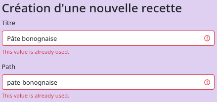
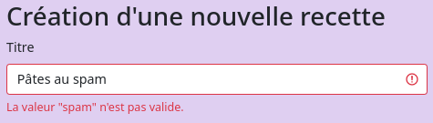
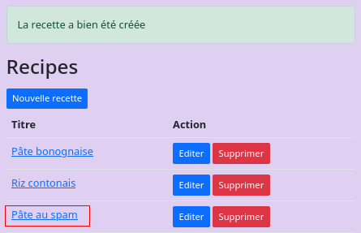

# Validation des données

## Gestion des contraintes au niveau des formulaires

```php
use Symfony\Component\Validator\Constraints\Length;
...

class RecipeType extends AbstractType {
    public function buildForm(FormBuilderInterface $builder, array $options): void  {
      $builder
         ->add('title', TextType::class, ['label' => 'Titre'])
         ->add('slug', TextType::class, [
               'label' => 'Path', 
               'required' => false, 
               'constraints' => [ 
                  new Length(min:10)
               ]
            ])
      ...
   }
   ...
}
```

La soumission nous renvoie sur page en affichant l'erreur. 


<br>

Cette validation est lié à la contrainte `$form->isValid()`.

```php
if ($form->isSubmitted() && $form->isValid()) {
   ...
}
```

<br>

Il est possible de forcer le message d'erreur à renvoyer.

```php
'constraints' => [
   new Length(min:10),
   new Regex('/^[a-z0-9]+(?:-[a-z0-9]+)*$/', message: 'Slug invalide')
]
```

Les deux messages sont affichés.


<br>

Il est possible de gérer le erreurs l'une après l'autre.

```php
'constraints' => new Sequentially( [ 
   new Length(min:10),
   new Regex('/^[a-z0-9]+(?:-[a-z0-9]+)*$/', message: 'Slug invalide')
])
```

Seul la première erreur est affichée.


<br>

## Gestion des contraintes au niveau des entités

La gestion des erreurs peut-être obtenue dans une *Entity* via des assertions.

```php
use Symfony\Component\Validator\Constraints as Assert;

#[ORM\Entity(repositoryClass: RecipeRepository::class)]
class Recipe {
   ...
   #[ORM\Column(length: 100)]
   #[Assert\Length(min: 10)]
   #[Assert\Regex('/^[a-z0-9]+(?:-[a-z0-9]+)*$/', message: 'Slug invalide')]
   private ?string $slug = null;
   ...
   #[ORM\Column(nullable: true)]
   #[Assert\Positive()]
   #[Assert\LessThan(value: 1440)]
   private ?int $duration = null;
   ...
```

<br>

Il est possible de mettre en place des contraintes d'unicité.

```php
use Symfony\Bridge\Doctrine\Validator\Constraints\UniqueEntity;

#[ORM\Entity(repositoryClass: RecipeRepository::class)]
// Les containtes d'unicités sont déclarées au niveau de la classe
#[UniqueEntity('title')]
#[UniqueEntity('slug')]
class Recipe {
   ...
```

Empêche l'insertion de deux mêmes recettes.



<br>

### Contraites personnalisées

Installer le *plugin* &nbsp;&#8640;&nbsp; `php bin/console make:validator`

```bash
 The name of the validator class (e.g. EnabledValidator):
 > BanWordValidator

 created: src/Validator/BanWordValidator.php
 created: src/Validator/BanWord.php
```

La classe *BanWord* représente la contrainte. 

```php
#[\Attribute(\Attribute::TARGET_PROPERTY | \Attribute::TARGET_METHOD | \Attribute::IS_REPEATABLE)]
class BanWord extends Constraint {
    public string $message = 'The value "{{ value }}" is not valid.';
}
```
<br>

On souhaite ajouter une liste de mots banis.

```php
class BanWord extends Constraint {

   // Création des attribus 'public' au niveau des constructeurs
   // Le constructeur est redéfinit et doit se claquer sur le constructeur parent :
   // function __construct(mixed $options = null, 
   //                      ?array $groups = null, 
   //                      mixed $payload = null) ...
   public function __construct(
      public string $message = 'The value "{{ banWord }}" is not valid.',
      public array $banWords = ['spam', 'viagra'],
      ?array $groups = null,
      mixed $payload = null ) {
         // ~ super() en Java
         parent::__construct(null, $groups, $payload);
   }
}
```

<br>

La classe *BanWordValidator* gère les erreurs.

```php
class BanWordValidator extends ConstraintValidator {
    public function validate(mixed $value, Constraint $constraint): void {
        /* @var BanWord $constraint */

        // La contraite est valide. 
        // le paramètre $value est une chaîne de caractère.
        if (null === $value || '' === $value) {
            return;
        }

        // Exécuté lors de la présence d'une erreur
        $this->context->buildViolation($constraint->message)
            ->setParameter('{{ value }}', $value)
            ->addViolation();
    }
}
```

<br>

Modifier la classe afin de traiter les mots banis.

```php
class BanWordValidator extends ConstraintValidator {

   public function validate(mixed $value, Constraint $constraint): void {

     // La contraite est valide. le paramètre $value est une chaîne de caractère.
     if (null === $value || '' === $value) {
         return;
     }

      // Les mots banis  ['spam', 'viagra'] seront déclaré en minuscule
      $value = strtolower($value);

      // DEFINITION DE LA CONTRAINTE
      // Boucle définis dans l'attribus de la classe 'BanWord'
      // L'instance de la classe 'BanWord' est injecté dans la classe BanWordValidator.
      foreach ($constraint->banWords as $banWord) {
         // Si la chaîne '$value' contient l'un des mots banis.
         if (str_contains($value, $banWord)) {

            // Exécuté lors de la présence d'une erreur
            $this->context->buildViolation($constraint->message)
               // L'attribue '$message' de la classe 'BanWord'
               // attend à présent le paramètre '{{ banWord }}'
               // et non {{ value }}
               ->setParameter('{{ banWord }}', $banWord)
               ->addViolation(); // Indique la présence d'un problème.
         }
     }
   }
}
```

<br>

Il est à présent possible de remonter des messages personnalisés.

<br>

Le message peut soit être celui définit par défaut dans le constructeur de la classe *BanWord* &nbsp;&#8640;&nbsp;
`public string $message = 'The value "{{ banWord }}" is not valid.'`

```php
use App\Validator\BanWord;
...
class Recipe {
   ...
   #[ORM\Column(length: 100)]
   #[BanWord()]
   private ?string $title = null;
```

<br>

Soit être directement être surchargé.

```php
use App\Validator\BanWord;
...
class Recipe {
   ...
   #[ORM\Column(length: 100)]
   #[BanWord(message: 'La valeur "{{ banWord }}" n\'est pas valide.')]
   private ?string $title = null;
```

Le mot *spam* est correctement détecté.



<br>

## Groupe de validation

Il est possible de filtrer les règles de validation à travers des groupes.

<br>

Le groupe 'Default' permettra la prise en charge de toutes les contraites sauf celles définies avec un group différent.

```php
class RecipeType extends AbstractType {
   ...
   public function configureOptions(OptionsResolver $resolver): void  {
        $resolver->setDefaults(['data_class' => Recipe::class, 
            # Les groupes permettent le désactivation des règles de validation
            'validation_groups' => ['Default']]);
    }
}
```

<br>

Si j'associe la contrainte *BanWord* à un groupe non déclaré dans le *'validation_groups'* (*'Extrat'*), elle ne sera plus en mesure de filtrer le 'title'.

```php
class Recipe {
   ... 
   #[ORM\Column(length: 100)]
   #[BanWord(  message: 'La valeur "{{ banWord }}" n\'est pas valide.', 
               groups: ['Extrat'])]
   private ?string $title = null;
```

La recette *"Pâte au spam"* est autorisé.



<br>