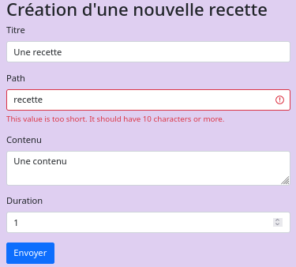
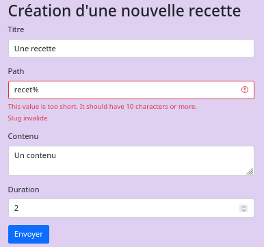

# Validation des données

## Gestion des contraintes au niveau des formulaires

```php
use Symfony\Component\Validator\Constraints\Length;
...

class RecipeType extends AbstractType {
    public function buildForm(FormBuilderInterface $builder, array $options): void  {
      $builder
         ->add('title', TextType::class, ['label' => 'Titre'])
         ->add('slug', TextType::class, [
               'label' => 'Path', 
               'required' => false, 
               'constraints' => [ 
                  new Length(min:10)
               ]
            ])
      ...
   }
   ...
}
```

La soumission nous renvoie sur page en affichant l'erreur. 



<br>

Cette validation est lié à la contrainte `$form->isValid()`.

```php
if ($form->isSubmitted() && $form->isValid()) {
   ...
}
```

<br>

Il est possible de forcer le message d'erreur à renvoyer.

```php
'constraints' => [
   new Length(min:10),
   new Regex('/^[a-z0-9]+(?:-[a-z0-9]+)*$/', message: 'Slug invalide')
]
```

Les deux messages sont affichés.



<br>

Il est possible de gérer le erreurs l'une après l'autre.

```php
'constraints' => new Sequentially( [ 
   new Length(min:10),
   new Regex('/^[a-z0-9]+(?:-[a-z0-9]+)*$/', message: 'Slug invalide')
])
```

Seul la première erreur est affichée.


<br>

## Gestion des contraintes au niveau des entités

La gestion des erreurs peut-être obtenue dans une *Entity* via des assertions.

```php
use Symfony\Component\Validator\Constraints as Assert;

#[ORM\Entity(repositoryClass: RecipeRepository::class)]
class Recipe {
   ...
   #[ORM\Column(length: 100)]
   #[Assert\Length(min: 10)]
   #[Assert\Regex('/^[a-z0-9]+(?:-[a-z0-9]+)*$/', message: 'Slug invalide')]
   private ?string $slug = null;
   ...
   #[ORM\Column(nullable: true)]
   #[Assert\Positive()]
   #[Assert\LessThan(value: 1440)]
   private ?int $duration = null;
   ...
```

<br>

Il est possible de mettre en place des contraintes d'unicité.

```php
use Symfony\Bridge\Doctrine\Validator\Constraints\UniqueEntity;

#[ORM\Entity(repositoryClass: RecipeRepository::class)]
// Les containtes d'unicités sont déclarées au niveau de la classe
#[UniqueEntity('title')]
#[UniqueEntity('slug')]
class Recipe {
   ...
```

Empêche l'insertion de deux mêmes recettes.


<br>