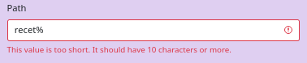

# Validation des données


```php
use Symfony\Component\Validator\Constraints\Length;
...

class RecipeType extends AbstractType {
    public function buildForm(FormBuilderInterface $builder, array $options): void  {
      $builder
         ->add('title', TextType::class, ['label' => 'Titre'])
         ->add('slug', TextType::class, [
               'label' => 'Path', 
               'required' => false, 
               'constraints' => [ 
                  new Length(min:10),
                  new Regex('/^[a-z0-9]+(?:-[a-z0-9]+)*$/', message: 'Slug invalide')
               ]
            ])
      ...
   }
   ...
}
```

La soumission nous renvoie sur page en affichant l'erreur. 


<br>

Cette validation est lié à la contrainte `$form->isValid()`.

```php
if ($form->isSubmitted() && $form->isValid()) {
   ...
}
```

<br>

Il est possible de forcer le message d'erreur à renvoyer.

```php
'constraints' => [
   new Length(min:10),
   new Regex('/^[a-z0-9]+(?:-[a-z0-9]+)*$/', message: 'Slug invalide')
]
```

Les deux messages sont affichés.


<br>

Il est possible de gérer le erreurs l'une après l'autre.

```php
'constraints' => new Sequentially( [ 
   new Length(min:10),
   new Regex('/^[a-z0-9]+(?:-[a-z0-9]+)*$/', message: 'Slug invalide')
])
```

Seul la première erreur est affichée.

