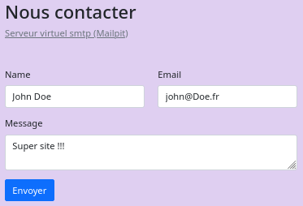
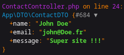

# Formulaire de contact


## Environnement


Configurer la connexion au serveur virtuel d'envoi d'email [*Mailpit*](http://localhost:8025/).


Renseigner la variable *MAILER_DSN* du fichier *TutoSymfony/**.env***.

```bash
MAILER_DSN=smtp://$SMTP_URL:1025
```

L'url de connexion est construite via la variable d'environnement consignée dans le fichier *.bashrc*

```bash
export SMTP_URL="localhost"
```

<br>

Mettre à jour le fichier de gestion des files d'attente  *TutoSymfony/config/packages/**messenger.yaml***.<br>
Le mails s'envoient par défaut sur *Messenger*, se qui bloque leurs envoies.

```yaml
framework:
    messenger:
      transports:
      # Créqtion d'une file synchrone, ne passant pas par Messenger.
         sync: 'sync://'

      # Les systèmes d'envois doivent $être configurés en 'synchrone'
      routing:
         Symfony\Component\Mailer\Messenger\SendEmailMessage: sync
         Symfony\Component\Notifier\Message\ChatMessage: sync
         Symfony\Component\Notifier\Message\SmsMessage: sync
```


<br>

Le serveur smtp peut-être testé avec une commande *curl*.

```bash
curl \
--url smtp://localhost:1025 \
--mail-from from@example.com \
--mail-rcpt to@example.com \
--upload-file - <<EOF
From: User Name <username@example.com>
To: John Doe <john@example.com>
Subject: You are awesome!
Content-Type: multipart/alternative; boundary="00000000000067dfe705d9d0ff7a"

--00000000000067dfe705d9d0ff7a
Content-Type: text/html; charset="UTF-8"
Content-Transfer-Encoding: quoted-printable

    <div>
        <p>Hello</p>
    </div>

--00000000000067dfe705d9d0ff7a--
EOF
```

<br>

## Email

### Data Transfert Object (DTO)

La struture des données gérée par formulaire sera définie par le DTO *TutoSymfony/src/DTO/*ContactDTO.php**.

```php
namespace App\DTO;

use Symfony\Component\Validator\Constraints as Assert;

class ContactDTO {
   #[Assert\NotBlank()]
   #[Assert\Length(min: 3, max: 70)]
   public string $name = '';

   #[Assert\NotBlank()]
   #[Assert\Email()]
   public string $email = '';

   #[Assert\NotBlank()]
   #[Assert\Length(min: 3, max: 70)]
   public string $message = '';
}
```

<br>

### Formulaire

Création du formulaire &nbsp;&#8640;&nbsp; `php bin/console make:form ContactType`

```bash
 The name of Entity or fully qualified model class name that the new form will be bound to (empty for none):
 > \App\DTO\ContactDTO

 created: src/Form/ContactType.php
```

<br>

Il a été nécessaire de renseigné le *namepace* *\App\DTO\ContactDTO* pour la création du formulaire *TutoSymfony/src/Form/**ContactType.php***.

```php
class ContactType extends AbstractType {

    public function buildForm(FormBuilderInterface $builder, array $options): void {
        $builder
            ->add('name')
            ->add('email')
            ->add('message')
            ->add('service')
        ;
    }

    public function configureOptions(OptionsResolver $resolver): void {
        $resolver->setDefaults([
            'data_class' => ContactDTO::class,
        ]);
    }
}
```

<br>

Les contrôles de la page web seront créés avec le type définie dans le formulaire.

```php
class ContactType extends AbstractType {

    public function buildForm(FormBuilderInterface $builder, array $options): void {
        $builder
            ->add('name', TextType::class, ['empty_data' => ''])
            ->add('email', EmailType::class, ['empty_data' => ''])
            ->add('message', TextareaType::class, ['empty_data' => '']);
    }
...
```

### Controller

Le formuaire sera envoyé à la page web via un *controller*.

Création du *cpntriller* &nbsp;&#8640;&nbsp; `php bin/console make:controller ContactController`

Actuellement le *controller* ne fait que qu'envoyer la formulaire à la page web
et en récupérer les données.

```php
class ContactController extends AbstractController {

   #[Route('/contact', name: 'contact')]
   public function index(Request $request): Response {

      // Récupération des données de la page web
      $contact = new ContactDTO();
      $form = $this->createForm(ContactType::class, $contact);
      $form->handleRequest($request);

      if ($form->isSubmitted() && $form->isValid()) {
         dd($contact);
      }

      // =====================================================
      // TODO : A SUPRIMER
      // Permet de pré-remplir le formulaire
      $contact->name = 'John Doe';
      $contact->email = 'john@Doe.fr';
      $contact->message = 'Super site !!!';
      $form = $this->createForm(ContactType::class, $contact);
      // =====================================================

      return $this->render('contact/index.html.twig', [
         'formContact' => $form,
      ]);
    }
}
```

<br>

Le formulaire est organisé de la façon suivante :

```html
<div class="d-flex flex-column mb-5">
	<h1>Nous contacter</h1>
	<a href="http://localhost:8025/" target="_blank" 
      class="link-secondary">Serveur virtuel smtp (Mailpit)</a>
</div>

{{ form_start(formContact) }}
<div class="row">
	<div class="col-sm">
		{{ form_row(formContact.name) }}
	</div>
	<div class="col-sm">
      {{ form_row(formContact.email) }}
   </div>
</div>
{{ form_end(formContact) }}
```

La page web initialisé.



<br>

Traces de l'objet '*$contact*' du *controller*.



<br>

#### Envoi d'email

On souhaite envoyer l'email au format html en respectant un template *TutoSymfony/templates/contact/**template.html.twig***.

```html
<p>Une nouvelle demande de contact a été reçue</p>
<ul>
	<li>Nom : {{ data.name }}</li>
	<li>Email : {{ data.email }}</li>
</ul>
<p>
	<strong>Message:</strong><br />
	{{ data.message | nl2br }}
</p>
```

<br>

Remplacer les traces `dd($contact)` par le [*mailer*](https://symfony.com/doc/current/mailer.html#creating-sending-messages).

```php
use Symfony\Component\Mailer\MailerInterface;
use Symfony\Bridge\Twig\Mime\TemplatedEmail;

class ContactController extends AbstractController
{
    #[Route('/contact', name: 'contact')]
    public function index( Request $request, 
                           MailerInterface $mailer): Response
    {
        $contact = new ContactDTO();
        $form = $this->createForm(ContactType::class, $contact);
        $form->handleRequest($request);

        if ($form->isSubmitted() && $form->isValid()) {
            try {

               $email = (new TemplatedEmail())
               ->from($contact->email)
               ->to('contact@demo.fr')
               ->subject('Demande de contact')
               ->htmlTemplate('contact/template.html.twig')
               ->context(['data' => $contact]);

               // Fournie par l'injection de dépendence 'MailerInterface'
               $mailer->send($email);

                $this->addFlash('success', 'L\'email a été envoyé');
            } catch (\Exception $e) {
                $this->addFlash('danger', 'Impossible d\'envoyer votre email');
            } finally {
                return $this->redirectToRoute('contact');
            }
        }

        // TODO : A supprimer
        // Permet de pré-remplir le formulaire
        $contact->name = 'John Doe';
        $contact->email = 'john@Doe.fr';
        $contact->message = 'Super site !!!';
        $form = $this->createForm(ContactType::class, $contact);

        return $this->render('contact/index.html.twig', [
            'formContact' => $form,
        ]);
    }
```

<br>

Vérifier le présence de l'email dans [*Mailpit*](http://localhost:8025/).


####  Gestion des destinataires

On souhaite pourvoir sélectionner un destinataire dans un menu déroulant.

Ajoutons un nouvel attribus au DTO *TutoSymfony/src/DTO/*ContactDTO.php** pour pouvoir sélectionner un service.

```php
class ContactDTO {
   ...
   #[Assert\NotBlank()]
   public string $service = '';
}
```

Il faut sélectionner un [text-fields](https://symfony.com/doc/current/reference/forms/types.html#text-fields) adapté dans notre formulaire.
Le choix se portera sur le contrôle `ChoiceType`.

Le formulaire de contact est modifié de la façon suivante :

```php
class ContactType extends AbstractType {
    public function buildForm(FormBuilderInterface $builder, array $options): void  {
        $builder
            ...
            // Menu déroulant des destinataires
            ->add('service', ChoiceType::class, [
                'choices'  => [
                    'Compta' => 'compta@demo.fr', // Séléctionné par défaut
                    'Support' => 'support@demo.fr',
                    'Marketing' => 'marketing@demo.fr',
                ]])
            ...
    }
```


<br>

Le formulaire sera organisé de la façon suivante :

```html
{{ form_start(formContact) }}
<div class="row">
	<div class="col-sm">
		{{ form_row(formContact.name) }}
	</div>
	<div class="col-sm">
      {{ form_row(formContact.email) }}
   </div>
   	<div class="col-sm">
      {{ form_row(formContact.service) }}
   </div>
</div>
{{ form_end(formContact) }}
```

<br>

La page web se présente à présent de la façon suivante :


<br>
