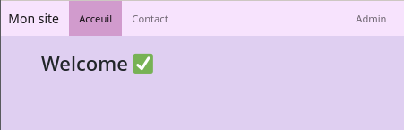
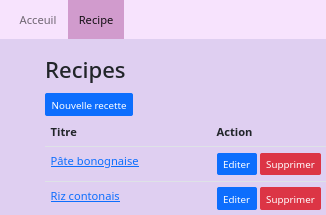
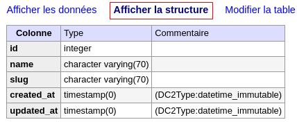
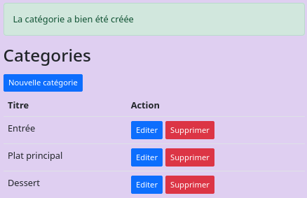

# Catégorie

## Reconfiguration du projet 

On souhaite réorganiser le projet en déplaçant la gestion des recettes au niveau d'un *back-office*.

- Re-création d'un *controller Recipe*  &nbsp;&#8640;&nbsp; `php bin/console make:controller admin\\RecipeController`


Mettre à jour les *path* du fichier *TutoSymfony/src/Controller/Admin/**RecipeController.php***.

- Route &nbsp;&#8640;&nbsp; `#[Route('/admin/recipe', name: 'admin.recipe.index')]`
- Rendu &nbsp;&#8640;&nbsp; `return $this->render('admin/recipe/index.html.twig' ...`
- Redirection &nbsp;&#8640;&nbsp; `return $this->redirectToRoute('admin.recipe.index');`

<br>

Le re-définition des routes peut-être facilitées par la notation.

```php
#[Route('/admin/recipe/', name: 'admin.recipe.')]
class RecipeController extends AbstractController {
   #[Route('', name: 'index')]
   ...
   #[Route('show/{id}', name: 'show')]
   ...
   #[Route('edit/{id}', name: 'edit')]
   ...
   #[Route('create', name: 'create')]
   ...
   #[Route('delete/{id}', name: 'delete', methods: ['DELETE'])]
...
```

<br>

Vérifier l'état des routes  &nbsp;&#8640;&nbsp; `php bin/console debug:route | grep admin`

```bash
admin.recipe.index         ANY      ANY      ANY    /admin/recipe/                     
admin.recipe.show          ANY      ANY      ANY    /admin/recipe/show/{id}            
admin.recipe.edit          ANY      ANY      ANY    /admin/recipe/edit/{id}            
admin.recipe.create        ANY      ANY      ANY    /admin/recipe/create               
admin.recipe.delete        DELETE   ANY      ANY    /admin/recipe/delete/{id} 
```


<br>

Dupliquer le fichier *base.html.twig* sous *TutoSymfony/templates/admin/**base.html.twig*** et mettre à jour la *navbar*.

```html
...
<nav class="navbar navbar-light mb-2 navbar-expand-sm" style="background-color: #f7e3fd;">
	<div class="container-fluid">
	   <button class="navbar-toggler collapsed" type="button" data-bs-toggle="collapse" data-bs-target="#monsite" aria-controls="monsite" aria-expanded="false" aria-label="Toggle navigation">
	      <span class="navbar-toggler-icon"></span>
	   </button>
		<div class="collapse navbar-collapse" id="monsite">
			<ul class="navbar-nav me-auto">
				<li class="nav-item">
					<a class="nav-link {{ app.current_route=='home'?'active':'' }}" href="{{ path("home") }}">Acceuil</a>
				</li>
				<li class="nav-item">
					<a class="nav-link {{ app.current_route starts with 'admin.recipe.'?'active':'' }}" href="{{ path("admin.recipe.index") }}">Recipe</a>
				</li>
			</ul>
		</div>
	</div>
</nav>
...
```

<br>

Ajouter le lien pointant vers l'interface d'administration dans le fichier *TutoSymfony/templates/**base.html.twig*** et supprimer celui pointant vers la liste des recettes.

```html
...
<li class="nav-item">
	<a class="nav-link {{ app.current_route starts with 'admin.recipe.'?'active':'' }}" href="{{ path("admin.recipe.index") }}">Admin</a>
</li>
...
```

<br>

Mettre à jour les liens et l'*extends* du fichier *TutoSymfony/templates/admin/recipe/i**ndex.html.twig***.

```html
<!-- Nouvelle navbar -->


Hello RecipeController!



	<h1 class="mb-3">Recipes</h1>

	<p class="mb-1">
		<a class="btn btn-primary btn-sm" href="{{ path("admin.recipe.create") }}">Nouvelle recette</a>
	</p>

	<table class="table">
		<tbody>
			<tr>
				<th>Titre</th>
				<th>Action</th>
			</tr>
		</tbody>
		
			<tr>
				<td>
					<a href="{{ url('admin.recipe.show', { id: recipe.id }) }}">{{ recipe.title }}</a>
				</td>
				<td>
					<div class="d-flex gap-1">
						<a class="btn btn-primary btn-sm" href="{{ path("admin.recipe.edit", {id: recipe.id }) }}">Editer</a>
						<form
							action="{{ path("admin.recipe.delete", {id: recipe.id }) }}" method="post">
							<input type="hidden" name="_method" value="DELETE">
							<button type="submit" class="btn btn-danger btn-sm">Supprimer</button>
						</form>
					</div>
				</td>
			</tr>
		
	</table>

```

<br>

Mettre à jour les *extends* des fichiers (``) :

- *TutoSymfony/templates/admin/recipe/**create.html.twig***
- *TutoSymfony/templates/admin/recipe/**edit.html.twig***
- *TutoSymfony/templates/admin/recipe/**show.html.twig***

<br>

- :warning: Supprimer le répertoire *TutoSymfony/templates/**recipe*** après avoir vérifié les redirections.
- :warning: Supprimer le fichier *TutoSymfony/src/Controller/**RecipeController.php*** après avoir vérifié les redirections.


<br>

Page web de présentation  :



<br>

Page web d'administration :




## Catégorie

On souhaite classer nos recettes par catégorie.

- Création d'un *controller* des categories  &nbsp;&#8640;&nbsp; `php bin/console make:controller admin\\CategoryController`


*TutoSymfony/src/Controller/Admin/**CategoryController.php*** sera calqué<br>
sur *TutoSymfony/src/Controller/Admin/**RecipeController.php***

```php
#[Route('/admin/category/', name: 'admin.category.')]
class CategoryController extends AbstractController {

    #[Route('', name: 'index')]
    public function index(): Response {
        return $this->render('admin/category/index.html.twig', [
            'controller_name' => 'CategoryController',
        ]);
    }

    #[Route('edit/{id}', name: 'edit')]
    public function edit() {
    }

    #[Route('create', name: 'create')]
    public function create() {
    }

    #[Route('delete/{id}', name: 'delete', methods: ['DELETE'])]
    public function delete() {
    }
}
```

<br>

Vérifier l'état des routes  &nbsp;&#8640;&nbsp; `php bin/console debug:route | grep category`

```bash
admin.category.index       ANY      ANY      ANY    /admin/category/                   
admin.category.edit        ANY      ANY      ANY    /admin/category/edit/{id}          
admin.category.create      ANY      ANY      ANY    /admin/category/create             
admin.category.delete      DELETE   ANY      ANY    /admin/category/delete/{id}    
```

<br>

## Model

Création du l'entité &nbsp;&#8640;&nbsp; `php bin/console make:entity Category`

```bash
 created: src/Entity/Category.php
 created: src/Repository/CategoryRepository.php
```

#### **name**

```bash
 New property name (press <return> to stop adding fields):
 > name

 Field type (enter ? to see all types) [string]:
 > 

 Field length [255]:
 > 70

 Can this field be null in the database (nullable) (yes/no) [no]:
 > 
```

#### **slug**

```bash
 New property name (press <return> to stop adding fields):
 > slug

 Field type (enter ? to see all types) [string]:
 > 

 Field length [255]:
 > 70

 Can this field be null in the database (nullable) (yes/no) [no]:
 > 
```

#### **createdAt**

```bash
 New property name (press <return> to stop adding fields):
 > createdAt

 Field type (enter ? to see all types) [datetime_immutable]:
 > 

 Can this field be null in the database (nullable) (yes/no) [no]:
 > 
```

#### **updatedAt**

```bash
 New property name (press <return> to stop adding fields):
 > updatedAt

 Field type (enter ? to see all types) [datetime_immutable]:
 > 

 Can this field be null in the database (nullable) (yes/no) [no]:
 > 
```

<br>

## Création des tables

#### Script de création

- Fichiers de création des tables &nbsp;&#8640;&nbsp; `php bin/console make:migration`

Le script *TutoSymfony/migrations/**VersionYYYYMMDDXXXXXX.php*** doit être vérifié avant sont exécution.

#### Création sous *Postgres*

- Création des tables sous *ProsgreSQL* &nbsp;&#8640;&nbsp; `php bin/console doctrine:migration:migrate --no-interaction`


La table a été créée avec les types de champ suivants :



<br>

### Formulaire

Création du formulaire &nbsp;&#8640;&nbsp; `php bin/console make:form CategoryType`

```bash
 The name of Entity or fully qualified model class name that the new form will be bound to (empty for none):
 > Category

 created: src/Form/CategoryType.php
```

<br>

On se calquera sur le formulaire *TutoSymfony/src/Form/**RecipeType.php***

```php
use Symfony\Component\Form\Extension\Core\Type\SubmitType;
use Symfony\Component\Form\Extension\Core\Type\TextType;
use Symfony\Component\Form\Event\PreSubmitEvent;
use Symfony\Component\Form\Event\PostSubmitEvent;
use Symfony\Component\Form\FormEvents;
use Symfony\Component\String\Slugger\AsciiSlugger;

class CategoryType extends AbstractType {

    public function buildForm(FormBuilderInterface $builder, array $options): void {
        $builder
            ->add('name', TextType::class, ['label' => 'Titre', 'empty_data' => ''])
            ->add('slug', TextType::class, ['label' => 'Path', 'required' => false, 'empty_data' => ''])
            ->add('save', SubmitType::class, ['label' => 'Envoyer'])
            ->addEventListener(FormEvents::PRE_SUBMIT, $this->autoSlug(...))
            ->addEventListener(FormEvents::POST_SUBMIT, $this->attachTimestamps(...));
    }

    function autoSlug(PreSubmitEvent $event): void  {
        $data = $event->getData();
        if (empty($data['slug'])) {
            $slugger = new AsciiSlugger();
            $data['slug'] = strtolower($slugger->slug($data['name']));
            $event->setData($data);
        }
    }

    function attachTimestamps(PostSubmitEvent $event): void  {

        $data = $event->getData();

        if($data instanceof Category) {
            $data->setUpdatedAt(new \DateTimeImmutable());
            // Nouvelle enregistrement
            if (!$data->getId()) {
                $data->setCreatedAt(new \DateTimeImmutable());
            }
        }
    }

    public function configureOptions(OptionsResolver $resolver): void {
        $resolver->setDefaults([
            'data_class' => Category::class,
        ]);
    }
}
```

<br>

### Controller

On se calquera sur le **controller** *TutoSymfony/src/Controller/Admin/**RecipeController.php***

```php
#[Route('/admin/category/', name: 'admin.category.')]
class CategoryController extends AbstractController {

    #[Route('', name: 'index')]
    public function index(CategoryRepository $categoryRepository): Response {
        $category = $categoryRepository->findAll();
        return $this->render('admin/category/index.html.twig', [
            'categories' => $category,
        ]);
    }

    #[Route('edit/{id}', name: 'edit')]
    public function edit(Category $category, Request $request, EntityManagerInterface $em): Response {
        $form = $this->createForm(CategoryType::class, $category);
        $form->handleRequest($request);

        if ($form->isSubmitted() && $form->isValid()) {
            $em->flush();
            $this->addFlash('success', 'La recette a bien été modifiée');
            return $this->redirectToRoute('admin.category.index');
        }

        return $this->render('admin/category/edit.html.twig', [
            'categoryData' => $category,
            'categoryForm' => $form
        ]);
    }

    #[Route('create', name: 'create')]
    public function create(Request $request, EntityManagerInterface $em): Response {
         $category = new Category();
        $form = $this->createForm(CategoryType::class, $category);
        $form->handleRequest($request);

        if ($form->isSubmitted() && $form->isValid()) {
            $em->persist($category);
            $em->flush();
            $this->addFlash('success', 'La catégorie a bien été créée');
            return $this->redirectToRoute('admin.category.index');
        }

        return $this->render('admin/category/create.html.twig', [
            'categoryForm' => $form
        ]);
    }

    #[Route('delete/{id}', name: 'delete', methods: ['DELETE'])]
    public function delete(Category $category, EntityManagerInterface $em): Response {
        $em->remove($category);
        $em->flush();
        $this->addFlash('success', 'La catégorie a été supprimée');
        return $this->redirectToRoute('admin.category.index');
    }
}
```

<br>

### Vues

On se calquera sur celles du dossier *TutoSymfony/templates/admin/**recipe***.



<br>

