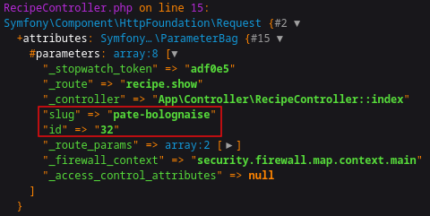

# Tuto Symfony

## HomeController

### Création du *controller* &nbsp;&#8640;&nbsp; `php bin/console make:controller HomeController`

Cette action génère les fichiers :
- *TutoSymfony/src/Controller/**HomeController.php***
- *TutoSymfony/templates/home/**index.html.twig***


Dans ce cas particulier, supprimer/commenter le `#[Route('/home', name: 'app_home')]` du fichier *HomeController.php* 

```php
class HomeController extends AbstractController {
    /* #[Route('/home', name: 'app_home')] */
    public function index(): Response {
        return $this->render('home/index.html.twig', [
            'controller_name' => 'HomeController',
        ]);
    }
}
```

Mettre à jour le fichier *TutoSymfony/config/routes.yaml* :

```yaml
home:
   path: /
   controller: App\Controller\HomeController::index
```

Tester l'application &nbsp;&#8640;&nbsp; `symfony server:start --port=8000 --no-tls`

La *Response* renvoyée peut-être une chaîne de caractère :

```php
class HomeController {
    public function index(): Response {
        return new Response('Bonjour les gens');
    }
}
```

#### Gestion des paramètres dans la requête *http*

La récupération des paramètres réalisés de façon classique oblige la mise en place d'un exception. 

```php
    public function index(): Response {
        try {
            return new Response('Hello '.$_GET['name']);
        } catch (\Exception $e) {
            // dd($e)
            return new Response('Hello Inconnu');
        }
    }
```

Cette exception peut automatiquement par l'utilisation d'une *Request* (le second paramètre est optionnel):

```php
    public function index(Request $request): Response {
        return new Response('Hello '.$request->query->get('name', 'Inconnu'));
    }
```

Tester en lançant l'[url](http://localhost:8000/?name=World).

<hr>

On souhaite récupérer les deux paramètres ***pate-bolognaise*** et ***32*** dans l'url de type [http://monsite/**pate-bolognaise**/**32**](http://localhost:8000/recipe/pate-bolognaise/32)


Création d'un *controller* &nbsp;&#8640;&nbsp; `php bin/console make:controller RecipeController`

```php
class RecipeController {
    #[Route('/recipe/{slug}/{id}', name: 'recipe.show')]
    public function index(Request $request): Response {
        dd($request);
        // dd($request->attributes->get('slug'), $request->attributes->getInt('id'));
    }
}
```

On constate la présence des deux attribus dans renvoyés par l'[url](http://localhost:8000/recipe/pate-bolognaise/32)

